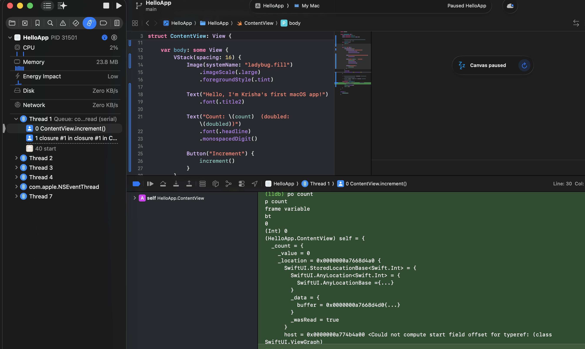
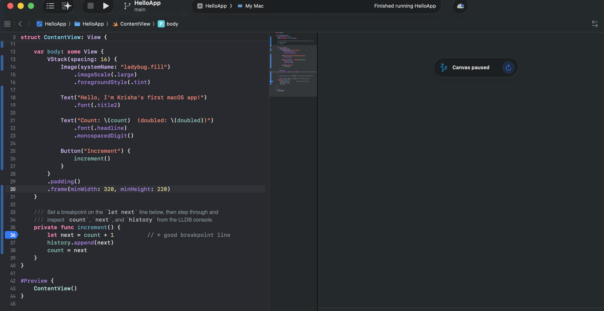

# 7.3 Debugging Tools — Breakpoints & LLDB

Notes and deliverables for exploring Xcode's debugger on the `HelloApp` project
(`XcodeDeepDive/HelloApp`). The app has a small counter with an `increment()`
function so there's real state to stop on and inspect.

## What I learned

**Breakpoints** pause execution at a chosen line so you can inspect the program's
state before it moves on. In Xcode you set one by clicking in the gutter to the
left of a line number (a blue arrow appears); click again to disable, or drag it
off to delete. The **Breakpoint Navigator** (⌘8) lists them all. Useful variants:

- **Conditional breakpoint** — right-click the breakpoint → *Edit Breakpoint…* →
  add a condition like `count == 3`, so it only pauses when that's true.
- **Action / log breakpoint** — attach a *Log Message* or *Debugger Command* and
  optionally tick *Automatically continue* to log without stopping.
- **Symbolic / exception breakpoint** — added from the `+` at the bottom of the
  Breakpoint Navigator; an *All Exceptions* breakpoint stops the moment a crash
  is thrown, which makes crashes far easier to trace.

**LLDB** is the command-line debugger behind Xcode. When execution is paused, the
console at the bottom (the `(lldb)` prompt) accepts commands. The ones I used:

| Command | Shortcut | What it does |
|---|---|---|
| `po <expr>` | print-object | Prints the object description of an expression |
| `p <expr>` / `print` | — | Prints a value with its type |
| `expression count = 10` | `e` | Evaluates / **changes** a variable live |
| `frame variable` | `fr v` | Lists all local variables in the current frame |
| `thread backtrace` | `bt` | Shows the call stack that led here |
| `continue` | `c` | Resumes running |
| `next` | `n` | Step over the current line |
| `step` | `s` | Step into a function call |
| `finish` | — | Run to the end of the current function |

The debug bar (above the console) has the equivalent buttons: Continue,
Step Over, Step Into, Step Out.

## Capture guide — how I took the screenshots

Do this in order; each numbered step is one screenshot.

1. **Open** `XcodeDeepDive/HelloApp/HelloApp.xcodeproj` in Xcode and open
   `ContentView.swift`.
2. **Set a breakpoint** by clicking the gutter on **line 36**
   (`let next = count + 1`) inside `increment()`. A blue marker appears.
   → *Screenshot 1: the breakpoint in the gutter.*
3. **Run** the app (⌘R). When it launches, click the **Increment** button. Execution
   pauses on line 36 and the line highlights green.
   → *Screenshot 2: paused at the breakpoint, debug area visible.*
4. In the `(lldb)` console, run these and let the output show:
   ```
   po count
   p count
   frame variable
   bt
   ```
   → *Screenshot 3: the LLDB console with these commands and their output.*
5. **Change a value live**, then keep going:
   ```
   expression count = 41
   continue
   ```
   The UI now shows `Count: 42` after the next increment — proof you edited state
   from LLDB.
   → *Screenshot 4 (optional): the running app reflecting the LLDB-modified value.*
6. **Optional — conditional breakpoint:** right-click the line-36 breakpoint →
   *Edit Breakpoint…* → condition `count == 3`. Run and click Increment a few
   times; it only stops on the third.
   → *Screenshot 5 (optional): the Edit Breakpoint popover with the condition.*

Save the images into `XcodeDeepDive/screenshots/` and link them below.

## Screenshots

**1. Breakpoint set on line 36** — the blue marker in the gutter, on
`let next = count + 1` inside `increment()`.



**2. Paused at the breakpoint, using LLDB** — execution stopped on line 36. The
Debug Navigator shows the thread's call stack (`increment()` → the Button's
action closure) with live CPU/Memory gauges, the Variables View shows `self`,
and the console shows `po count`, `p count`, `frame variable`, and `bt` with
their output.


