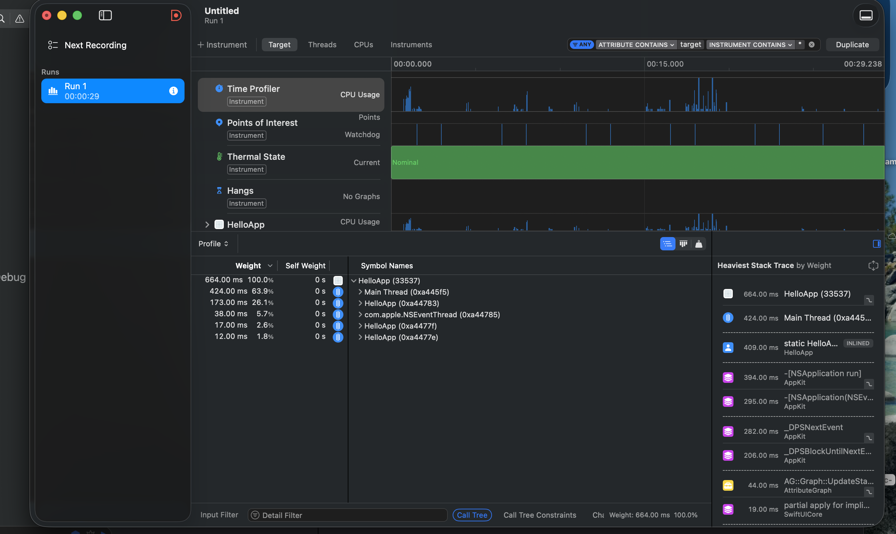
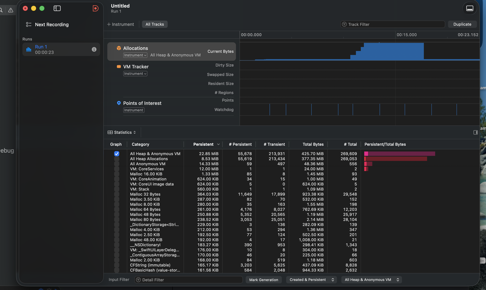

# 7.4 Instruments — CPU & Memory Profiling Summary

Profiling the `HelloApp` project (`XcodeDeepDive/HelloApp`) with Xcode
**Instruments**. The app has two deliberate workloads added for this exercise:

- **Run CPU Work** — a 20-million-iteration `squareRoot()` loop on a background
  queue (`runCPUWork()`), so the CPU spikes for a moment.
- **Allocate ~80 MB / Release Memory** — allocates a 10-million-element `Int`
  array and holds it (`allocateMemory()`), then frees it (`releaseMemory()`), so
  the memory footprint visibly climbs and drops.

## What Instruments is

**Instruments** is Xcode's performance-analysis app. You launch it with
**Product → Profile (⌘I)**, which builds a Release-style optimized build and lets
you pick a *template* — each template records a different aspect of the app while
it runs. The two used here:

- **Time Profiler** — samples the call stack ~1000×/sec and shows where CPU time
  is spent. The **Call Tree** (bottom pane) ranks functions by how much time was
  spent in them; "invert call tree" and "hide system libraries" make *your* hot
  code easy to spot.
- **Allocations** — tracks every heap allocation and the total live memory. The
  **Persistent Bytes / #Persistent** columns show what's still resident; the graph
  shows the footprint over time. (The **Leaks** instrument, often run alongside,
  flags memory that was allocated but is no longer reachable.)

## Capture guide

Profile the CPU and the memory separately; each numbered step is one observation
(and a good screenshot).

### A. CPU — Time Profiler
1. In Xcode: **Product → Profile (⌘I)**. When Instruments opens, choose
   **Time Profiler**, then press the red **record** button.
2. In the running app, click **Run CPU Work** a few times.
3. Watch the CPU track spike. Stop recording (the ■ button).
4. In the **Call Tree**, tick *Invert Call Tree* and *Hide System Libraries*
   (bottom-right options). Expand until you see `runCPUWork()` / the
   `squareRoot` loop near the top — that's your hot path.
   → *Screenshot: the Time Profiler timeline + call tree with `runCPUWork` highlighted.*

### B. Memory — Allocations
1. Stop the previous run. **Product → Profile (⌘I)** again → choose
   **Allocations** → record.
2. Note the baseline footprint. Click **Allocate ~80 MB** two or three times and
   watch the **Persistent Bytes** / footprint graph step up (~80 MB each click).
3. Click **Release Memory** and watch it drop back down — that confirms ARC
   reclaims it and there's no leak.
4. Stop recording.
   → *Screenshot: the Allocations graph showing the climb and the drop.*

Save screenshots into `XcodeDeepDive/screenshots/` and link them below.

## Summary of results

Numbers below are from my actual runs (Time Profiler run = 29 s,
Allocations run = 23 s).

### CPU (Time Profiler)
| Metric | Value |
|---|---|
| Total sampled CPU time in run | 664 ms (100%) |
| Main Thread | 424 ms (63.9%) |
| Background worker thread running `runCPUWork` | 173 ms (26.1%) |
| `com.apple.NSEventThread` | 38 ms (5.7%) |
| Thermal state during run | Nominal |

**Observation:** At rest the CPU track is flat — the app does nothing. Each
*Run CPU Work* click produces a sharp, short-lived spike in the CPU Usage graph.
Because the loop runs on a background `DispatchQueue`, the work lands on a
separate worker thread (~173 ms, 26.1% of samples) rather than the main thread,
so the UI stays responsive throughout. Ticking *Invert Call Tree* +
*Hide System Libraries* collapses the stack straight down to the `squareRoot`
loop inside `runCPUWork()` — the true hot path.

### Memory (Allocations)
| Metric | Value |
|---|---|
| Persistent (live) at end of run — All Heap & Anonymous VM | 22.85 MiB |
| Total bytes allocated over the run | 425.70 MiB |
| Live vs. transient allocations | 55,678 persistent / 213,931 transient |
| Growth per *Allocate* click | ~80 MB (10M × 8-byte Int) |
| Leaks reported | None observed |

**Observation:** The *Current Bytes* graph climbs in clear ~80 MB steps as
*Allocate* is clicked, then drops back after *Release Memory* — exactly the
expected shape. The large 425.70 MiB *total* against only 22.85 MiB *persistent*
confirms most of that memory was transient: allocated, then reclaimed by ARC once
the held array was cleared. The footprint returning toward baseline (rather than
staying elevated) is the signal that there is no leak.

## Takeaways
- Time Profiler answers *"what is my app spending CPU on?"* — the call tree
  isolates the hot function fast once system libraries are hidden.
- Allocations answers *"what is holding memory?"* — persistent bytes rising and
  not falling is the signal of a leak or an unbounded cache.
- Moving heavy work off the main thread (as `runCPUWork()` does) keeps the UI
  responsive even while the CPU is busy.

## Screenshots

**1. Time Profiler (CPU)** — the CPU Usage track shows spikes from *Run CPU Work*;
the call tree breaks time down by thread (main 63.9%, background worker 26.1%).

**2. Allocations (memory)** — the *Current Bytes* graph climbs in ~80 MB steps as
memory is allocated; the statistics table shows 22.85 MiB persistent vs.
425.70 MiB total.

