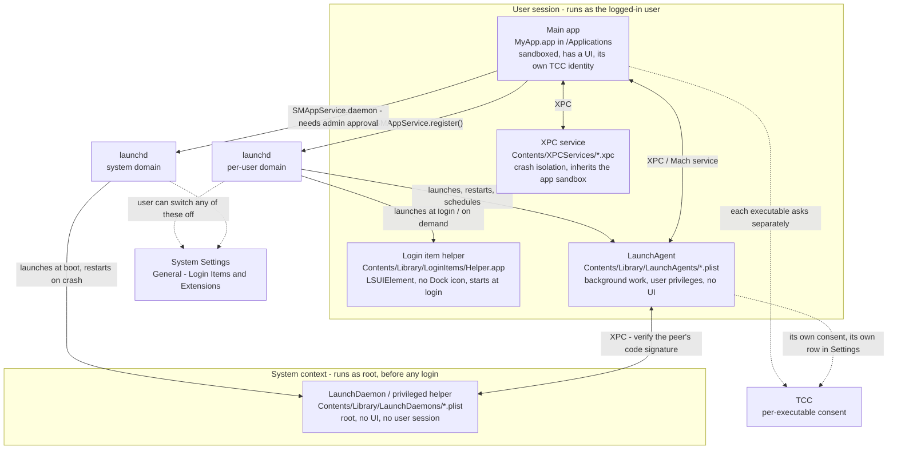
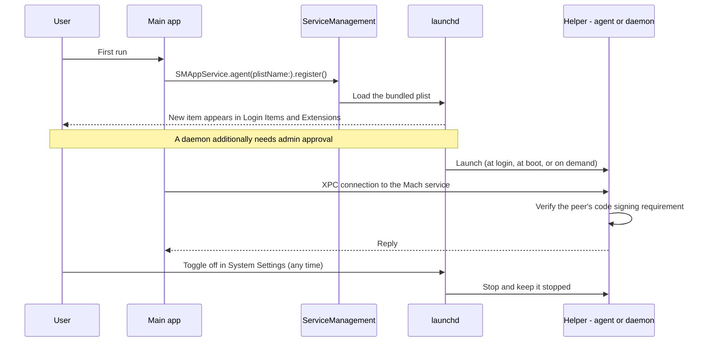

# 8.7 Helpers, Login Items & Privileged Tools

**Deliverable:** architecture diagram.

A Mac app that has to keep working when its window is closed — sync in the
background, start at login, block distractions, touch something only root can
touch — stops being one process. This is the shape of that system, and who is
allowed to do what.

## The architecture



Two rules the diagram is really about:

1. **Trust drops as you go up the picture, privilege rises as you go down.**
   Everything in the user session runs with the user's rights and can be revoked
   by the user. The daemon runs as root and can't be, which is why installing one
   requires an admin and why it should do as little as possible.
2. **Every box is its own TCC client and its own sandbox subject.** Permissions
   don't flow from the app to its helpers. If the agent is the process that reads
   the Accessibility API, the *agent* needs Accessibility — granting it to the app
   does nothing.

## Registration and talking to a helper



## Which mechanism for which job

| Need | Use | Runs as | User-visible |
| --- | --- | --- | --- |
| Start with the user, no UI, light work | **Login item helper** or **LaunchAgent** | the user | Login Items & Extensions |
| Background work with schedules, restart-on-crash, on-demand launch | **LaunchAgent** | the user | Login Items & Extensions |
| Crash isolation or privilege separation *within* the app | **XPC service** in the bundle | the user, sandbox inherited | no |
| Work at boot, before/without login; anything needing root | **LaunchDaemon / privileged helper** | root | Login Items & Extensions, admin approval |

If the job doesn't genuinely need root, don't reach for a daemon: it's the one
piece the user can't sandbox, can't inspect easily, and can't safely be wrong.

## Modern vs legacy

Everything moved to `SMAppService` in macOS 13, and the plists moved *inside* the
app bundle — so they're covered by the app's code signature and can't be edited by
the system or a third party without breaking it.

| Old way | Now |
| --- | --- |
| `SMLoginItemSetEnabled` | `SMAppService.loginItem(identifier:).register()` |
| `SMJobBless` + `/Library/PrivilegedHelperTools` | `SMAppService.daemon(plistName:).register()` |
| Plists dropped in `/Library/LaunchAgents`, `/Library/LaunchDaemons` | `Contents/Library/LaunchAgents`, `Contents/Library/LaunchDaemons` inside the bundle |
| Invisible to the user | Every item listed in **System Settings → General → Login Items & Extensions** |

```swift
let agent = SMAppService.agent(plistName: "com.krisha.helper.plist")

try agent.register()      // appears in Login Items & Extensions
print(agent.status)       // .enabled / .requiresApproval / .notRegistered / .notFound
try agent.unregister()
```

`status` is the one to handle properly: `.requiresApproval` means the user hasn't
switched it on yet, and the only correct response is to explain and point at
System Settings — exactly the Accessibility pattern from 8.1.

## Security rules for the privileged end

- **Same team, verified both ways.** A helper must check the code signing
  requirement of whoever connects to it (`SecCodeCheckValidity` /
  `SecTaskCopySigningIdentifier` on the connection's audit token), not just accept
  any caller. The classic macOS privilege-escalation bug is a root helper that
  trusts its client because "only our app knows the Mach service name".
- **Keep the privileged surface tiny.** The daemon should expose a handful of
  narrow operations, never "run this command for me".
- **Validate every argument.** A path from an unprivileged caller is attacker-
  controlled input once it reaches root.
- **Uninstall properly.** `unregister()`, then remove the files. Stale entries can
  linger in Login Items; `sudo sfltool resetbtm` resets that pane to defaults.

## Inspecting what's actually running

```bash
launchctl list | grep krisha              # per-user domain
sudo launchctl list | grep krisha         # system domain
launchctl print gui/$(id -u)/com.krisha.helper
codesign -dvvv /Applications/MyApp.app/Contents/Library/LoginItems/Helper.app
log stream --predicate 'process == "launchd"' --info
```

## Why this matters for Focus Bear

A focus app is exactly this diagram: the window is optional, but the thing that
notices which app you're in has to run whenever you're logged in. That's a
**LaunchAgent** in the user session — not a daemon, because it needs the user's
session and the user's Accessibility grant, and a root daemon can't have either.
It also means the agent (not the app) is what appears in the Accessibility list,
and what the user switches off when they want it to stop.

## What I learned

Splitting an app across processes is a privilege decision before it's an
architecture decision: each executable gets its own identity, its own sandbox,
its own TCC consent, and its own row in System Settings. The modern
`SMAppService` design makes that visible on purpose — bundled plists that the
signature covers, and a settings pane where every background item shows up and
can be switched off. The old world let an installer scatter root-owned plists
across the filesystem with nothing to show for it in the UI, and it's obvious why
Apple closed that.

## Sources

- [Updating your app package installer to use the new Service Management API](https://developer.apple.com/documentation/servicemanagement/updating-your-app-package-installer-to-use-the-new-service-management-api) — Apple
- [`SMAppService`](https://developer.apple.com/documentation/servicemanagement/smappservice) — Apple
- [The SMAppService API — quick notes](https://theevilbit.github.io/posts/smappservice/)
